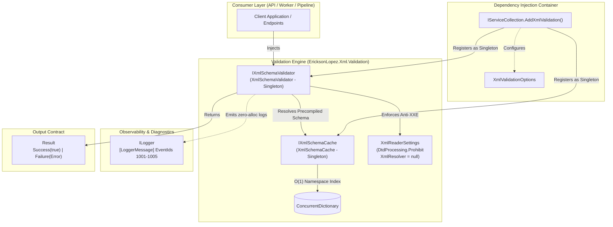
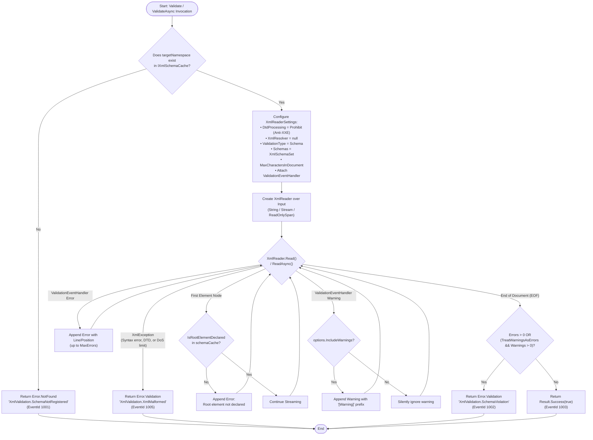
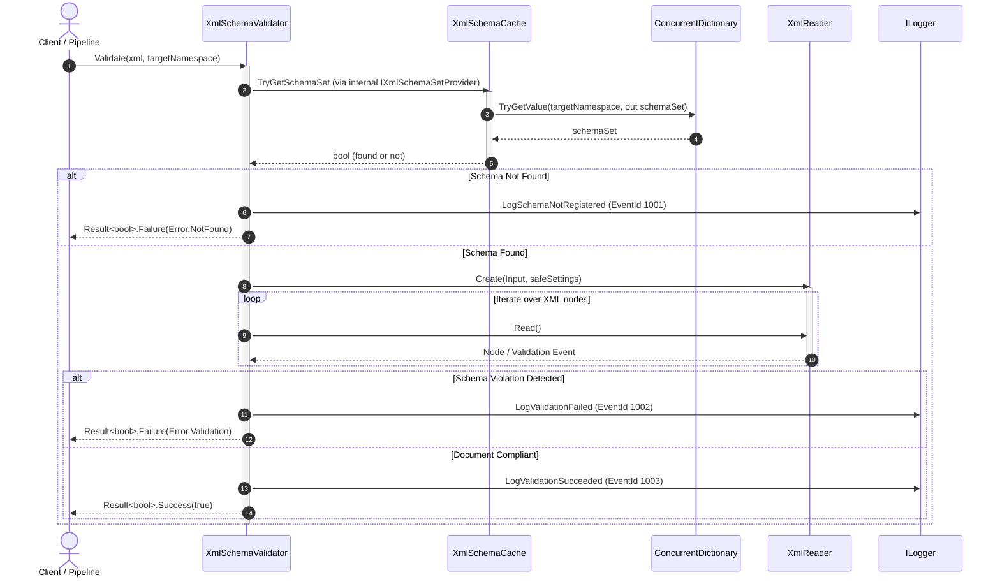
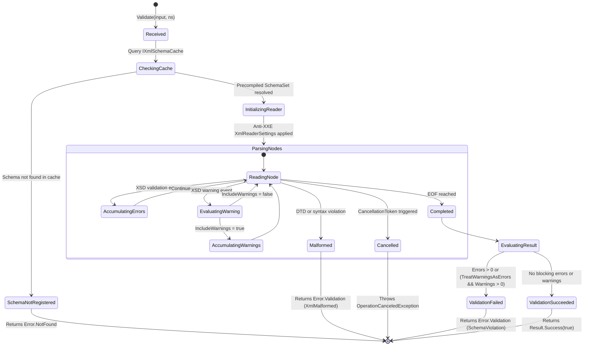
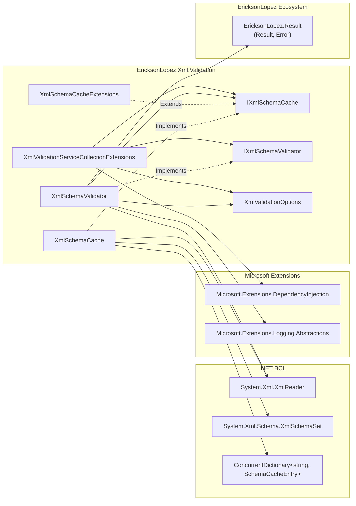
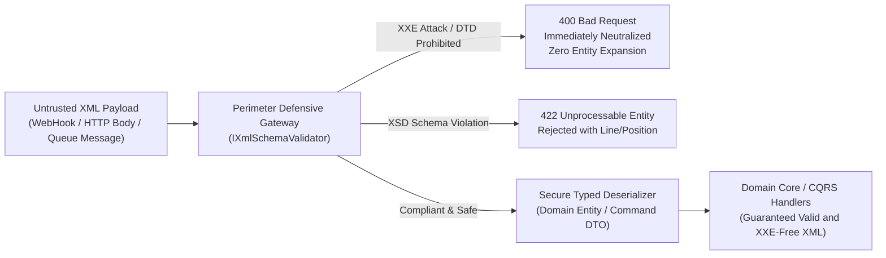

# Architecture & Flow Diagrams — EricksonLopez.Xml.Validation

Architectural diagrams and technical execution flows for **`EricksonLopez.Xml.Validation`**, derived directly from the verified source code.

---

## 1. High-Level System Architecture

The following diagram illustrates layer separation, isolation boundaries, and relationships between the consumer, the dependency injection container, and core validation components:

---

## 2. End-to-End Validation Flow

The complete decision logic and data transformation pipeline executed on every call to `Validate` or `ValidateAsync`:

---

## 3. Validation Sequence Diagram

Collaborator interactions across synchronous and asynchronous execution paths:

---

## 4. Validation Lifecycle State Machine

Formal state transitions representing an in-flight validation request:

---

## 5. Component Dependency Graph

Detailed package boundaries, interfaces, and framework dependencies:

---

## 6. Defensive Anti-XXE Perimeter Ingestion Pipeline

How `IXmlSchemaValidator` acts as a frontline firewall (DMZ) in enterprise ingestion architectures:

