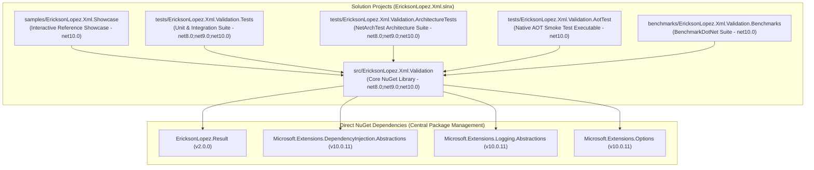

# Architecture Guide — EricksonLopez.Xml.Validation

Architectural design principles, system invariants, boundaries, and internal relationships governing `EricksonLopez.Xml.Validation`.

---

## 1. Package Mission

`EricksonLopez.Xml.Validation` is a foundational Tier 0 component in the `EricksonLopez.*` .NET ecosystem. Its sole responsibility is to provide an ultra-secure, high-performance, and typed Result-oriented (`Result<bool>`) XML Schema (XSD) validation engine, eliminating XML External Entity (XXE) attack vectors and repetitive schema compilation overhead.

---

## 2. Internal Project Dependencies & Solution Graph

---

## 3. Core System Invariants & Architectural Decision Records (ADRs)

The architectural decisions governing `EricksonLopez.Xml.Validation` are formalized in 17 dedicated records:

| ADR | Title | Key Architectural Principle |
|:---:|:---|:---|
| [**ADR-001**](adr/adr-001-anti-xxe-by-default.md) | Anti-XXE Enforced by Default | `DtdProcessing.Prohibit` and `XmlResolver = null` enforced unconditionally across all reader and compiler paths with zero public opt-outs. |
| [**ADR-002**](adr/adr-002-result-instead-of-exceptions.md) | Result Pattern Instead of Exceptions | Schema violations, syntax errors, and missing schemas return typed `Result<bool>` failures, avoiding expensive exception stack unwinding. |
| [**ADR-003**](adr/adr-003-namespace-as-cache-key.md) | Target Namespace as Primary Cache Key | Precompiled schemas are indexed 1:1 by XML target namespace in a thread-safe `ConcurrentDictionary`. |
| [**ADR-004**](adr/adr-004-warnings-configurable.md) | Configurable Schema Warning Handling | Warnings are captured optionally or escalated to validation failures via `XmlValidationOptions`. |
| [**ADR-005**](adr/adr-005-no-schematron.md) | Omission of Schematron and RelaxNG | Pure W3C XSD focus ensures zero third-party dependencies and guaranteed Native AOT compatibility. |
| [**ADR-006**](adr/adr-006-mutation-testing-quality-gate.md) | Mutation Testing Quality Gate | Mandatory $\ge 95\%$ break threshold enforced via Stryker.NET in CI/CD before release packaging. |
| [**ADR-007**](adr/adr-007-zero-allocation-span-validation.md) | Reduced-Allocation Span Validation | Direct `ReadOnlySpan<byte>` validation via native memory pinning (`fixed`) eliminates intermediate managed string allocations. |
| [**ADR-008**](adr/adr-008-async-stream-cancellation-tokens.md) | Async Streaming Validation with Cancellation | Streaming validation with cooperative `CancellationToken` checks on node reads and pre-flight validation. |
| [**ADR-009**](adr/adr-009-logger-message-partial-methods.md) | Zero-Allocation Diagnostic Logging | C# source-generated `[LoggerMessage]` partial methods (Event IDs 1001–1005) avoid boxing and string formatting allocations. |
| [**ADR-010**](adr/adr-010-service-collection-extensions-lifetime.md) | Singleton Service Lifetime | `IXmlSchemaCache` and `IXmlSchemaValidator` are registered as singletons with thread-safe lock-free reads. |
| [**ADR-011**](adr/adr-011-native-aot-compilation-pipeline.md) | Native AOT Compilation Pipeline | Continuous ahead-of-time Linux compilation smoke tests ensure zero IL trimming warnings and runtime integrity. |
| [**ADR-012**](adr/adr-012-error-taxonomy-code-structure.md) | Structured Error Taxonomy | Standardized error codes (`XmlValidation.SchemaNotRegistered`, `XmlValidation.SchemaViolation`, `XmlValidation.XmlMalformed`). |
| [**ADR-013**](adr/adr-013-thread-safe-precompiled-schema-cache.md) | Thread-Safe Precompiled Schema Cache | Atomic precompilation and immutable cache entries guarantee thread safety under extreme concurrent load. |
| [**ADR-014**](adr/adr-014-benchmark-regression-policy.md) | Continuous Benchmark Regression Policy | Pull requests must maintain zero heap allocations on hot paths and $\le 5\%$ latency variance vs baseline. |
| [**ADR-015**](adr/adr-015-multi-targeting-strategy.md) | Multi-Targeting Strategy | Native targeting for `.NET 8.0`, `.NET 9.0`, and `.NET 10.0` with identical API surface and feature parity. |
| [**ADR-016**](adr/adr-016-architecture-testing-and-ci-cd-quality-gates.md) | Architecture Testing Suite & CI/CD Gates | NetArchTest rules enforce type sealing, interface naming, namespace isolation, and zero `[Obsolete]` APIs. |
| [**ADR-017**](adr/adr-017-extensibility-boundary-and-schema-cache-contract-segregation.md) | Extensibility Boundary & Schema Cache Segregation | Segregates public `IXmlSchemaCache` from internal `IXmlSchemaSetProvider` to preserve cache immutability and Anti-XXE invariants. |

---

## 4. Core Type Design & Architectural Patterns

### 4.1 Type Hierarchy & Member Design

- **Interfaces:**
  - `IXmlSchemaValidator`: Primary validation contract for consumers.
  - `IXmlSchemaCache`: Primary schema registration and cache contract.
  - `IXmlSchemaSetProvider`: `internal` interface isolating mutable `XmlSchemaSet` access to prevent cache mutation by consumers (XML-API-001).
- **Concrete Classes:**
  - `XmlSchemaValidator`: `public sealed partial class` implementing `IXmlSchemaValidator`. Marked `sealed` to prevent unintended inheritance and optimize JIT devirtualization. Marked `partial` to support source-generated `[LoggerMessage]` logging methods.
  - `XmlSchemaCache`: `public sealed class` implementing `IXmlSchemaCache` and `IXmlSchemaSetProvider`. Backed by `ConcurrentDictionary<string, SchemaCacheEntry>` for $O(1)$ lock-free read concurrency.
  - `XmlValidationOptions`: `public sealed class` encapsulating pipeline knobs (`IncludeWarnings`, `TreatWarningsAsErrors`, `MaxCharactersInDocument`, `MaxErrors`, `ProcessInlineSchema`).
- **Internal Records:**
  - `SchemaCacheEntry`: `private sealed record` encapsulating the compiled `XmlSchemaSet` and a precomputed `HashSet<(string LocalName, string NamespaceUri)>` of declared global elements for rapid $O(1)$ root-element validation.
- **Static Extension Classes:**
  - `XmlSchemaCacheExtensions`: `public static class` extending `IXmlSchemaCache` with disk file and directory registration helpers (`RegisterSchemaFile`, `RegisterSchemasFromDirectory`).
  - `XmlValidationServiceCollectionExtensions`: `public static class` extending `IServiceCollection` with `AddXmlValidation()` container registration.

### 4.2 Implemented Architectural Patterns

1. **Result Pattern (Railway-Oriented Programming):** Replaces exception-driven control flow with functional `Result<bool>` and typed `Error` descriptors.
2. **Defensive Perimeter Gateway:** Frontline validation of untrusted XML payloads prior to deserialization or domain processing.
3. **Decorator Pattern for Extensibility:** Enables wrapping `IXmlSchemaValidator` for custom telemetry, metrics, or auditing without modifying library internals.
4. **Precompiled Thread-Safe Cache:** Separates expensive design-time schema compilation ($O(N)$) from runtime document validation ($O(1)$ cache lookup).

---

## 5. Architectural Boundaries & Explicit Exclusions

- **Messaging Brokering (RabbitMQ, Kafka, Azure Service Bus):** Intentionally excluded; belongs to application messaging infrastructure.
- **Distributed Locking:** Intentionally excluded; belongs to distributed coordination layers.
- **Schematron Semantic Validation (ISO/IEC 19757-3):** Intentionally excluded to maintain zero third-party dependencies, Native AOT compliance, and minimal memory footprint (see [ADR-005](adr/adr-005-no-schematron.md)).
- **XSLT Transforms and XQuery Engines:** Intentionally excluded; belongs to document transformation pipelines.
