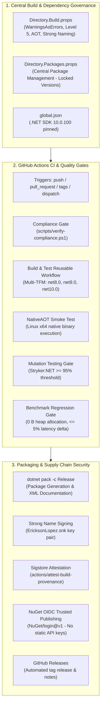
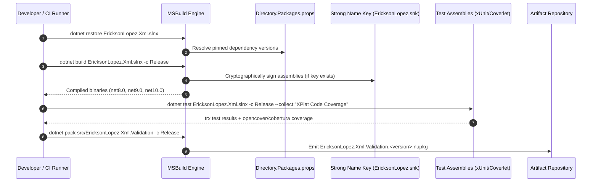
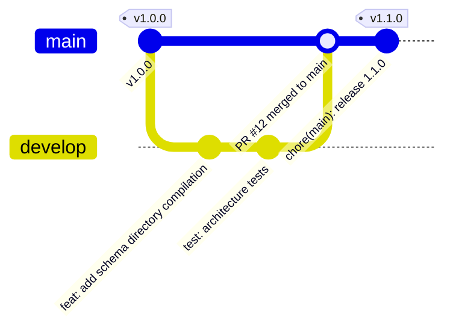
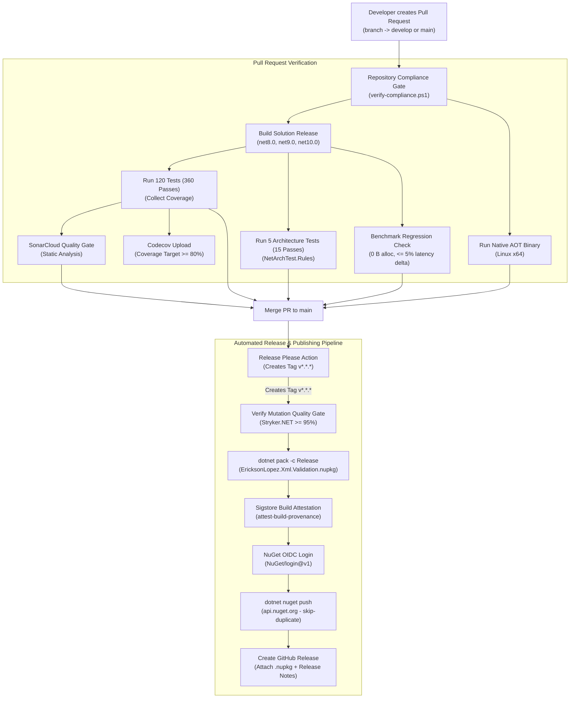

# Build, Quality Gates & CI/CD Specification — EricksonLopez.Xml.Validation

Comprehensive engineering specification for solution compilation, testing harness, automated quality gates, CI/CD pipelines, and supply chain security for `EricksonLopez.Xml.Validation`.

---

## 1. System Overview & Build Architecture

`EricksonLopez.Xml.Validation` implements a deterministic, zero-tolerance build and verification lifecycle. Compilation policies, Roslyn analyzer levels, warning escalation, and package dependencies are centrally controlled via MSBuild properties and Central Package Management (CPM).



---

## 2. Central MSBuild Configuration (`Directory.Build.props`)

Every project across the repository inherits unified compilation rules from [`Directory.Build.props`](../Directory.Build.props):

| MSBuild Property | Configured Value | Architectural Rationale |
|---|---|---|
| `<TargetFrameworks>` | `net8.0;net9.0;net10.0` | Multi-targets active Long Term Support (LTS) and Standard Term Support (STS) .NET runtimes. |
| `<LangVersion>` | `latest` | Enables contemporary C# 12/13/14 language features across all build targets. |
| `<Nullable>` | `enable` | Enforces non-nullable reference types and Roslyn static nullability analysis. |
| `<ImplicitUsings>` | `enable` | Enables standard BCL implicit namespace imports consistently across all projects. |
| `<TreatWarningsAsErrors>` | `true` | Zero-tolerance compiler policy: any warning immediately fails the build. |
| `<WarningLevel>` | `5` | Enables highest standard Roslyn compiler diagnostic level. |
| `<AnalysisLevel>` | `latest-recommended` | Enforces recommended .NET code quality and style analyzers. |
| `<IsAotCompatible>` | `true` | Validates Native AOT readiness during Roslyn compilation. |
| `<EnableTrimAnalyzer>` | `true` | Analyzes code paths for intermediate language (IL) trimming compatibility. |
| `<GenerateDocumentationFile>` | `true` | Emits XML documentation comments (`.xml`) for IDE IntelliSense on library projects. |
| `<ManagePackageVersionsCentrally>` | `true` | Activates NuGet Central Package Management (CPM). |
| `<NoWarn>` | *None* | Zero-tolerance warning policy; all compiler and analyzer diagnostics are remediated without suppression. |

---

## 3. Build & Test Process

### 3.1 Build Lifecycle: Restore → Build → Test → Coverage → Pack

The standard build lifecycle proceeds through deterministic phases:



### 3.2 Debug vs. Release Configurations

- **`Debug`**:
  - Full debugging symbols (`portable` PDBs) with unoptimized code generation.
  - Used for local interactive debugging and stepping through schema compilation state machines.
- **`Release`**:
  - Full compiler optimization (`/optimize+`) enabled.
  - XML documentation file emitted (`EricksonLopez.Xml.Validation.xml`).
  - Strict warning escalation (`TreatWarningsAsErrors=true`) enforced.
  - Required for packaging, benchmarking, mutation testing, and production deployment.

### 3.3 Strong Name Signing Architecture

Assemblies are conditionally signed via RSA key pair using properties in [`Directory.Build.props`](../Directory.Build.props):

```xml
<SignAssembly Condition="Exists('$(MSBuildThisFileDirectory)EricksonLopez.snk')">true</SignAssembly>
<AssemblyOriginatorKeyFile Condition="Exists('$(MSBuildThisFileDirectory)EricksonLopez.snk')">$(MSBuildThisFileDirectory)EricksonLopez.snk</AssemblyOriginatorKeyFile>
<PublicKey Condition="'$(SignAssembly)' == 'true'">0024000004800000940000000602000000240000525341310004000001000100655c867cb6d2e3a8d53e10d858994a49ea6b428de6e1e2eec19c71f0409345a7bf1649e9208282982347d90153f237f1aef003468e4a913598faa0b96815de53ede401790587fef88c7869884cdbf4372e74a44facf7dd6995e9b832285f8c548f531e1886d6712632139b617cd4f13988021b7cc32b5c3af18f52e19ae2a6cc</PublicKey>
<DefineConstants Condition="'$(SignAssembly)' == 'true'">$(DefineConstants);SIGN_ASSEMBLY</DefineConstants>
```

In CI pipelines, the base64-encoded secret `SNK_KEY` is decoded before compilation:
```bash
if [ -n "$SNK_KEY" ]; then
  echo "$SNK_KEY" | tr -d '\n\r ' | base64 --decode > EricksonLopez.snk
fi
```
This ensures that the public key token remains deterministic across builds while keeping the private key secure.

---

## 4. GitHub Actions Workflows Inventory

The repository configures 10 specialized GitHub Actions workflows located in `.github/workflows/`:

| # | Workflow File | Workflow Name | Trigger(s) | Primary Purpose |
|---|---|---|---|---|
| 1 | [`ci.yml`](../.github/workflows/ci.yml) | `CI` | `push`, `pull_request` (branches: `main`, `develop`) | Master CI pipeline executing compliance, build/test, and AOT smoke gates. |
| 2 | [`dotnet-build-test.yml`](../.github/workflows/dotnet-build-test.yml) | `Reusable — .NET Build & Test` | `workflow_call` | Reusable multi-TFM compilation, test execution, SonarCloud analysis, and Codecov upload. |
| 3 | [`publish.yml`](../.github/workflows/publish.yml) | `Publish to NuGet` | `push` (tags: `v*.*.*`), `workflow_dispatch` | Release pipeline with mutation gate, Sigstore attestation, NuGet OIDC publishing, and GitHub Release. |
| 4 | [`aot-smoke-test.yml`](../.github/workflows/aot-smoke-test.yml) | `NativeAOT Smoke Test` | `workflow_call`, `push`, `pull_request` (`main`, `develop`), `workflow_dispatch` | Publishes and executes native Linux binary to verify IL trimming and AOT runtime invariants. |
| 5 | [`mutation-testing.yml`](../.github/workflows/mutation-testing.yml) | `Mutation Testing (Stryker)` | `workflow_call`, `push`/`pull_request` (`main`), cron (`0 3 * * 0`), `workflow_dispatch` | Evaluates test suite mutation score via Stryker.NET (enforces $\ge 95\%$ quality gate). |
| 6 | [`benchmarks.yml`](../.github/workflows/benchmarks.yml) | `Benchmarks` | `workflow_call`, `workflow_dispatch` | On-demand BenchmarkDotNet execution with markdown step summaries and artifact persistence. |
| 7 | [`benchmark-regression-gate.yml`](../.github/workflows/benchmark-regression-gate.yml) | `Benchmark Regression Gate` | `pull_request` (`main`, `develop`), `workflow_dispatch` | Enforces zero-allocation (0 B) heap invariant and $\le 5\%$ latency regression gate against baseline. |
| 8 | [`weekly-benchmarks.yml`](../.github/workflows/weekly-benchmarks.yml) | `Weekly Benchmarks (Deep Review)` | cron (`0 2 * * 0` — Sundays 02:00 UTC), `workflow_dispatch` | Deep multi-framework (.NET 8, 9, 10) performance benchmarking. |
| 9 | [`release-please.yml`](../.github/workflows/release-please.yml) | `Release Please` | `push` (`main`) | Automates semantic version bumps, CHANGELOG generation, and triggers `publish.yml` on release. |
| 10 | [`repo-compliance.yml`](../.github/workflows/repo-compliance.yml) | `Repository Compliance & Quality Gate` | `push`, `pull_request` (`main`, `develop`), `workflow_dispatch` | Standalone validation of repository compliance, build diagnostics, test execution, and packing. |

---

## 5. Detailed Workflow Specifications

### 5.1 `ci.yml` (Continuous Integration Orchestrator)
- **File:** [`.github/workflows/ci.yml`](../.github/workflows/ci.yml)
- **Triggers:** `push` and `pull_request` to `main` and `develop`.
- **Jobs:**
  1. `compliance-gate`: Runs on `ubuntu-latest`. Checks out repository, sets up .NET SDK 10.0.x, and executes `pwsh ./scripts/verify-compliance.ps1`. Fails immediately if any governance, file naming, or boundary violation is detected.
  2. `build-and-test`: Depends on `compliance-gate`. Invokes reusable workflow `./.github/workflows/dotnet-build-test.yml` with `artifact-name: test-results`.
  3. `aot-smoke-test`: Depends on `compliance-gate`. Invokes reusable workflow `./.github/workflows/aot-smoke-test.yml`.
- **Secrets Forwarded:** `SNK_KEY`, `CODECOV_TOKEN`, `SONAR_TOKEN`.

### 5.2 `dotnet-build-test.yml` (Reusable Build & Test)
- **File:** [`.github/workflows/dotnet-build-test.yml`](../.github/workflows/dotnet-build-test.yml)
- **Triggers:** `workflow_call`
- **Inputs:**
  - `dotnet-version` (string, default: `"10.0.x"`): Primary SDK version.
  - `test-filter` (string, default: `""`): Filter expression passed to `dotnet test`.
  - `test-project` (string, default: `""`): Specific test project path.
  - `upload-coverage` (boolean, default: `true`): Whether to upload coverage to Codecov.
  - `artifact-name` (string, default: `"test-results"`): Name for uploaded test artifacts.
- **Secrets:** `SNK_KEY` (optional), `CODECOV_TOKEN` (optional), `SONAR_TOKEN` (optional).
- **Steps:**
  1. Checkout with full history (`fetch-depth: 0`).
  2. Multi-.NET SDK setup: `8.0.x`, `9.0.x`, `10.0.x`.
  3. Restore `EricksonLopez.snk` from base64 secret `SNK_KEY`.
  4. Restore dependencies for `EricksonLopez.Xml.slnx`.
  5. Setup Java 17 Zulu and install `dotnet-sonarscanner`.
  6. Begin SonarCloud analysis (if `SONAR_TOKEN` present) with OpenCover report paths and coverage exclusions.
  7. Compile solution in `Release` mode (`--no-restore`).
  8. Execute tests across all runtimes with Cobertura and OpenCover collectors.
  9. End SonarCloud analysis.
  10. Upload test results (`test-results.trx`) via `actions/upload-artifact@v4`.
  11. Upload coverage report to Codecov via `codecov/codecov-action@v5.3.1`.
- **Artifacts Produced:** `./test-results/` (TRX files, `coverage.cobertura.xml`, `coverage.opencover.xml`).

### 5.3 `publish.yml` (Publish to NuGet & Release)
- **File:** [`.github/workflows/publish.yml`](../.github/workflows/publish.yml)
- **Triggers:**
  - `push` with tag pattern `v*.*.*`.
  - `workflow_dispatch` with optional `version` input (e.g., `1.0.0`).
- **Permissions:** `id-token: write`, `contents: write`, `attestations: write`, `statuses: read`, `actions: read`.
- **Jobs:**
  1. `mutation-gate-check`: Runs `scripts/verify-mutation-gate.js` to evaluate whether the commit on `main` has a verified passing Stryker mutation status. Outputs: `needs_stryker`, `can_proceed`, `evaluated_commit`, `mutation_score`.
  2. `stryker-gate`: Conditional job executed if `needs_stryker == 'true'`. Invokes `mutation-testing.yml` with `full-run: true`.
  3. `publish`: Executes only if mutation quality gates pass. Steps:
     - Resolve target version from dispatch input, tag name, or `Directory.Build.props`.
     - Setup .NET SDK 10.0.x and restore Strong Name key.
     - Restore and build solution in `Release` configuration.
     - Execute pre-publish test suite and upload coverage report to Codecov.
     - Pack `src/EricksonLopez.Xml.Validation/EricksonLopez.Xml.Validation.csproj` into `./artifacts/`.
     - Generate cryptographic Sigstore Provenance Attestation via `actions/attest-build-provenance@v2.2.3`.
     - Authenticate with NuGet.org via OpenID Connect (OIDC) using `NuGet/login@v1`.
     - Push package via `dotnet nuget push ./artifacts/*.nupkg --source https://api.nuget.org/v3/index.json --skip-duplicate`.
     - Create official GitHub Release with release notes and attached `.nupkg` via `softprops/action-gh-release@v2.0.8`.
- **Secrets Used:** `SNK_KEY`, `CODECOV_TOKEN`, `GITHUB_TOKEN`. (NuGet publishing uses OIDC `id-token` without static API keys).

### 5.4 `aot-smoke-test.yml` (Native AOT Smoke Verification)
- **File:** [`.github/workflows/aot-smoke-test.yml`](../.github/workflows/aot-smoke-test.yml)
- **Triggers:** `workflow_call`, `push`/`pull_request` (`main`, `develop`), `workflow_dispatch`.
- **Steps:**
  1. Setup .NET SDKs (8.0, 9.0, 10.0) and restore `EricksonLopez.snk`.
  2. Install Linux native build prerequisites: `clang`, `lld`, `zlib1g-dev`.
  3. Compile solution in `Release` mode.
  4. Publish `tests/EricksonLopez.Xml.Validation.AotTest/` using `dotnet publish -c Release -r linux-x64 --self-contained -p:TreatWarningsAsErrors=true -o ./aot-output`.
  5. Execute `./aot-output/EricksonLopez.Xml.Validation.AotTest` directly as a native ELF binary.
  6. Verifies that Anti-XXE enforcement, synchronous validation, streaming, and span operations succeed without JIT runtime or IL reflection warnings.

### 5.5 `mutation-testing.yml` (Stryker.NET Mutation Analysis)
- **File:** [`.github/workflows/mutation-testing.yml`](../.github/workflows/mutation-testing.yml)
- **Triggers:** `workflow_call`, `push`/`pull_request` (`main` with path filters), Sunday cron (`0 3 * * 0`), `workflow_dispatch`.
- **Steps:**
  1. Checkout with full history.
  2. Setup .NET SDK 10.0.x and restore CPM dependencies.
  3. Install `dotnet-stryker` local or global tool.
  4. Execute `dotnet stryker --config-file stryker-config.json`.
  5. Enforces configured thresholds: High `100%`, Low `98%`, Break `95%`. A mutation score below 95% exits with non-zero status.
  6. Uploads Stryker HTML report as artifact `stryker-report-${{ github.run_id }}` (retention: 30 days).
  7. Sets GitHub commit status `Stryker Mutation Quality Gate` with score description.

### 5.6 `benchmark-regression-gate.yml` (Automated Performance Gate)
- **File:** [`.github/workflows/benchmark-regression-gate.yml`](../.github/workflows/benchmark-regression-gate.yml)
- **Triggers:** `pull_request` (`main`, `develop`) affecting `src/**` or `benchmarks/**`, `workflow_dispatch`.
- **Steps:**
  1. Setup multi-.NET SDKs and restore dependencies.
  2. Compile solution in `Release` configuration.
  3. Run benchmarks on PR head:
     ```bash
     dotnet run --project benchmarks/EricksonLopez.Xml.Validation.Benchmarks/EricksonLopez.Xml.Validation.Benchmarks.csproj \
       --configuration Release --framework net10.0 -- --filter "*" --job short --exporters json --memory --artifacts ./benchmarks/pr-results
     ```
  4. Evaluate gate via `pwsh ./scripts/verify-benchmark-gate.ps1`:
     - Baseline comparison against `benchmarks/results/baseline.json`.
     - Zero-allocation verification: hot-path span operations must allocate exactly **0 B**.
     - Mean latency regression must not exceed **5%** vs. baseline.
  5. Upload benchmark results artifact (`retention-days: 30`).

### 5.7 `benchmarks.yml` & `weekly-benchmarks.yml`
- **`benchmarks.yml`:** On-demand runner accepting `benchmark-filter` input. Emits markdown summaries directly into `$GITHUB_STEP_SUMMARY` and uploads artifact bundle.
- **`weekly-benchmarks.yml`:** Scheduled Sunday 02:00 UTC execution performing cross-TFM deep evaluation across .NET 8, 9, and 10 runtimes.

### 5.8 `release-please.yml` (Automated Versioning)
- **File:** [`.github/workflows/release-please.yml`](../.github/workflows/release-please.yml)
- **Trigger:** `push` to `main`.
- **Mechanism:**
  - Evaluates conventional commits via `googleapis/release-please-action@v4.1.3`.
  - Maintains `.release-please-manifest.json` and updates `CHANGELOG.md`.
  - When a release PR is merged, creates git tag `v*.*.*` and triggers `publish.yml` via GitHub REST API `createWorkflowDispatch`.

### 5.9 `repo-compliance.yml` (Standalone Compliance Gate)
- **File:** [`.github/workflows/repo-compliance.yml`](../.github/workflows/repo-compliance.yml)
- **Triggers:** `push`, `pull_request` (`main`, `develop`), `workflow_dispatch`.
- **Steps:**
  - Executes `./scripts/verify-compliance.ps1` enforcing zero violations.
  - Builds solution with `TreatWarningsAsErrors`.
  - Executes unit and architecture tests.
  - Verifies `dotnet pack` generates valid NuGet package archive without warnings.

---

## 6. Quality Gates & Enforcement Thresholds

| Quality Gate | Tool / Engine | Config File | Threshold / Standard | Action on Violation |
|---|---|---|---|---|
| **Repository Governance** | Custom PowerShell Verifier | [`scripts/verify-compliance.ps1`](../scripts/verify-compliance.ps1) | 0 violations (naming, links, boundary, CPM) | Job fails |
| **Compiler Diagnostics** | Roslyn / MSBuild | [`Directory.Build.props`](../Directory.Build.props) | WarningLevel 5, AnalysisLevel latest-recommended, TreatWarningsAsErrors | Compilation fails |
| **Unit & Integration Tests** | xUnit 2.9.3 + AwesomeAssertions 9.6.0 | [`tests/EricksonLopez.Xml.Validation.Tests/`](../tests/EricksonLopez.Xml.Validation.Tests/) | 100% pass across net8.0, net9.0, net10.0 (360 passes) | Build fails |
| **Architectural Rules** | NetArchTest.Rules 1.3.2 | [`tests/EricksonLopez.Xml.Validation.ArchitectureTests/`](../tests/EricksonLopez.Xml.Validation.ArchitectureTests/) | 100% pass across net8.0, net9.0, net10.0 (15 passes) | Build fails |
| **Code Coverage** | Coverlet 10.0.1 + Codecov | [`.codecov.yml`](../.codecov.yml) | Minimum **80%** line coverage target (90% aspirational) | PR warning / CI failure |
| **Mutation Testing** | Stryker.NET | [`stryker-config.json`](../stryker-config.json) | High: 100%, Low: 98%, Break: **$\ge 95\%$** | Pipeline break |
| **Static Code Analysis** | SonarCloud Scanner | [`.github/workflows/dotnet-build-test.yml`](../.github/workflows/dotnet-build-test.yml) | Sonar Way Quality Gate | PR check failure |
| **Native AOT Trimming** | .NET Native AOT Compiler | [`tests/EricksonLopez.Xml.Validation.AotTest/`](../tests/EricksonLopez.Xml.Validation.AotTest/) | Binary executes successfully, 0 trim warnings | AOT job fails |
| **Allocation Invariant** | BenchmarkDotNet + Verifier | [`scripts/verify-benchmark-gate.ps1`](../scripts/verify-benchmark-gate.ps1) | **0 B** heap allocation on span operations | PR gate fails |
| **Latency Regression** | BenchmarkDotNet + Verifier | [`benchmarks/results/baseline.json`](../benchmarks/results/baseline.json) | Mean latency regression **$\le 5\%$** vs baseline | PR gate fails |
| **Dependency Scanning** | GitHub Dependabot | [`.github/dependabot.yml`](../.github/dependabot.yml) | Weekly checks on `nuget` and `github-actions` | Auto-generated security PR |

---

## 7. Branch & Environment Strategy

Based on GitHub Actions triggers and workflows, the repository follows a trunk-based development strategy with an integration branch:



- **`main`**:
  - Production-ready branch.
  - Protected: direct pushes restricted; merges require passing PR checks (`compliance-gate`, `build-and-test`, `aot-smoke-test`).
  - Triggers `release-please.yml` for automated release PR generation and changelog management.
  - Tags matching `v*.*.*` trigger the production `publish.yml` pipeline.
- **`develop`**:
  - Active integration branch for feature stabilization.
  - Validated by full CI matrix on every push and PR.
- **Feature / Fix Branches (`feat/*`, `fix/*`, `chore/*`)**:
  - PRs targeting `main` or `develop` trigger `ci.yml` and `benchmark-regression-gate.yml`.

---

## 8. Release Strategy & Supply Chain Security

### 8.1 Semantic Versioning & Release Flow
1. **Conventional Commits:** Developers follow Conventional Commits (`feat:`, `fix:`, `perf:`, `chore:`).
2. **Release Please:** Evaluates commit messages and creates/updates a release candidate PR containing updated `CHANGELOG.md` and version manifest.
3. **Merge to `main`:** When the release PR is merged, Release Please creates a git tag `vMAJOR.MINOR.PATCH`.
4. **Publish Trigger:** The tag creation triggers `publish.yml`. Pre-release suffixes (e.g. `-preview.1`) are detected automatically if present in tag names.

### 8.2 Supply Chain Security Pillars
- **Strong Name Signing:** Protects against assembly spoofing and allows consumption in strong-named enterprise environments.
- **Sigstore Provenance Attestation (`actions/attest-build-provenance`):** Emits cryptographic build attestations linked to GitHub Actions execution identity, satisfying SLSA Level 3 provenance requirements.
- **NuGet Trusted Publishing (OIDC):** Authenticates directly to NuGet.org via short-lived OpenID Connect JWT tokens (`NuGet/login@v1`), eliminating long-lived, static API keys.
- **Reproducible CPM Builds:** Dependency versions locked centrally in `Directory.Packages.props`, preventing supply chain transitive package hijacking.

---

## 9. End-to-End Delivery Pipeline Flow


