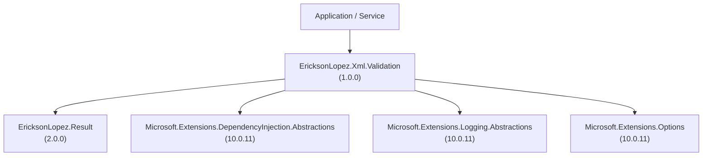

# NuGet Package Specification & Compatibility Matrix — EricksonLopez.Xml.Validation

Comprehensive packaging, dependency graph, runtime compatibility matrix, and ecosystem integration specification for **`EricksonLopez.Xml.Validation`**.

---

## 1. Published Packages & Project Inventory

The solution [`EricksonLopez.Xml.slnx`](../EricksonLopez.Xml.slnx) contains 6 projects, producing exactly one published NuGet package:

| Project Path | Project Type | Target Frameworks | Packable | Package ID / Output |
|---|---|---|---|---|
| [`src/EricksonLopez.Xml.Validation/EricksonLopez.Xml.Validation.csproj`](../src/EricksonLopez.Xml.Validation/EricksonLopez.Xml.Validation.csproj) | Library | `net8.0;net9.0;net10.0` | **`true`** | [`EricksonLopez.Xml.Validation`](https://www.nuget.org/packages/EricksonLopez.Xml.Validation) |
| [`samples/EricksonLopez.Xml.Showcase/EricksonLopez.Xml.Showcase.csproj`](../samples/EricksonLopez.Xml.Showcase/EricksonLopez.Xml.Showcase.csproj) | Console App (Sample) | `net10.0` | `false` | Interactive 11-level showcase application |
| [`tests/EricksonLopez.Xml.Validation.Tests/EricksonLopez.Xml.Validation.Tests.csproj`](../tests/EricksonLopez.Xml.Validation.Tests/EricksonLopez.Xml.Validation.Tests.csproj) | Test Suite | `net8.0;net9.0;net10.0` | `false` | 193 unique unit, integration, and concurrency tests (579 passes) |
| [`tests/EricksonLopez.Xml.Validation.ArchitectureTests/EricksonLopez.Xml.Validation.ArchitectureTests.csproj`](../tests/EricksonLopez.Xml.Validation.ArchitectureTests/EricksonLopez.Xml.Validation.ArchitectureTests.csproj) | Architecture Tests | `net8.0;net9.0;net10.0` | `false` | 6 NetArchTest structural and design rule tests (18 passes) |
| [`tests/EricksonLopez.Xml.Validation.AotTest/EricksonLopez.Xml.Validation.AotTest.csproj`](../tests/EricksonLopez.Xml.Validation.AotTest/EricksonLopez.Xml.Validation.AotTest.csproj) | Native AOT Test | `net10.0` | `false` | Ahead-of-Time executable smoke test harness (20 passes) |
| [`benchmarks/EricksonLopez.Xml.Validation.Benchmarks/EricksonLopez.Xml.Validation.Benchmarks.csproj`](../benchmarks/EricksonLopez.Xml.Validation.Benchmarks/EricksonLopez.Xml.Validation.Benchmarks.csproj) | Benchmark App | `net10.0` | `false` | BenchmarkDotNet micro-benchmarks with regression gates |

---

## 2. Runtime & Framework Compatibility Matrix

`EricksonLopez.Xml.Validation` is multi-targeted for `.NET 8.0` (LTS), `.NET 9.0` (STS), and `.NET 10.0` (Current/LTS).

| Target Framework | Windows (x64/x86/arm64) | Linux (x64/arm64) | macOS (x64/arm64) | Native AOT | Trimming Safe | Support Lifecycle |
|---|---|---|---|---|---|---|
| **`.NET 8.0`** | Supported | Supported | Supported | Verified | Verified | Active LTS |
| **`.NET 9.0`** | Supported | Supported | Supported | Verified | Verified | Active STS |
| **`.NET 10.0`** | Supported | Supported | Supported | Verified | Verified | Active Current |

### Binary Invariants
- **Platform Independence:** Pure managed C# code; no native OS P/Invoke calls.
- **Ahead-of-Time Readiness:** Built with `<IsAotCompatible>true</IsAotCompatible>` and `<EnableTrimAnalyzer>true</EnableTrimAnalyzer>`.
- **Zero Reflection on Critical Paths:** Schema compilation and validation rely exclusively on standard BCL `XmlReader` and precompiled `XmlSchemaSet` primitives.

---

## 3. Dependency Graph & Central Package Management

All package dependencies are managed centrally via [`Directory.Packages.props`](../Directory.Packages.props) using `<ManagePackageVersionsCentrally>true</ManagePackageVersionsCentrally>`:



### Dependency Versions Matrix

| Dependency | Scope | Version | License | Justification |
|---|---|---|---|---|
| `EricksonLopez.Result` | Direct (Production) | `2.0.0` | MIT | Strongly-typed Railway-Oriented error handling (`Result<bool>`) |
| `Microsoft.Extensions.DependencyInjection.Abstractions` | Direct (Production) | `10.0.11` | MIT | `IServiceCollection` extension methods |
| `Microsoft.Extensions.Logging.Abstractions` | Direct (Production) | `10.0.11` | MIT | High-performance `[LoggerMessage]` structured diagnostics |
| `Microsoft.Extensions.Options` | Direct (Production) | `10.0.11` | MIT | `XmlValidationOptions` configuration pattern |
| `Microsoft.Extensions.DependencyInjection` | Transitive / Tests / Showcase | `10.0.11` | MIT | Full DI container provider for integration and samples |
| `Microsoft.Extensions.Logging` | Tests / Showcase | `10.0.11` | MIT | Logging provider factory |
| `Microsoft.Extensions.Logging.Console` | Showcase | `10.0.11` | MIT | Console logging provider for showcase |
| `Microsoft.NET.Test.Sdk` | Tests | `18.9.0` | MIT | Test runner infrastructure |
| `xunit` | Tests | `2.9.3` | Apache-2.0 | Unit test framework |
| `xunit.runner.visualstudio` | Tests | `4.0.0` | Apache-2.0 | Visual Studio / `dotnet test` test runner adapter |
| `AwesomeAssertions` | Tests | `9.6.0` | Apache-2.0 | Fluent assertion library |
| `NetArchTest.Rules` | Architecture Tests | `1.3.2` | MIT | Architecture and structural rule verification |
| `coverlet.collector` | Tests | `10.0.1` | MIT | Cross-platform code coverage collector |
| `BenchmarkDotNet` | Benchmarks | `0.15.8` | MIT | Performance benchmarking and allocation diagnoser |
| `Microsoft.SourceLink.GitHub` | Build / Packaging | `10.0.400` | MIT | SourceLink integration for source debugging |

---

## 4. Public API Surface Summary

The library exports a focused, cohesive public surface through namespace `EricksonLopez.Xml.Validation`:

| Type | Kind | Key Members | Description |
|---|---|---|---|
| `IXmlSchemaCache` | Interface | `RegisterSchema(string, string)`, `RegisterSchema(string, Stream)`, `RegisterSchema(string, ReadOnlySpan<byte>)`, `ContainsSchema(string)`, `Count`, `IsRootElementDeclared(string, string, string)`, `Clear()` | Thread-safe schema registry and precompilation manager. |
| `XmlSchemaCache` | Sealed Class | Implements `IXmlSchemaCache`, `IXmlSchemaSetProvider` | Production schema cache backed by `ConcurrentDictionary<string, SchemaCacheEntry>`. |
| `XmlSchemaCacheExtensions` | Static Class | `RegisterSchemaFile(this IXmlSchemaCache, string, string)`, `RegisterSchemasFromDirectory(this IXmlSchemaCache, string, string)` | Extension methods providing filesystem and directory-based bulk schema compilation. |
| `IXmlSchemaValidator` | Interface | `Validate(string, string)`, `Validate(Stream, string)`, `Validate(ReadOnlySpan<byte>, string)`, `ValidateAsync(Stream, string, CancellationToken)` | Core validation contract returning `Result<bool>`. |
| `XmlSchemaValidator` | Sealed Class | Implements `IXmlSchemaValidator` | Production validator with Anti-XXE defaults and zero-allocation logging. |
| `XmlValidationOptions` | Sealed Class | `IncludeWarnings`, `TreatWarningsAsErrors`, `MaxCharactersInDocument`, `MaxErrors`, `ProcessInlineSchema` | Pipeline configuration options for warning handling, DoS defense, and schema processing. |
| `XmlValidationServiceCollectionExtensions` | Static Class | `AddXmlValidation(this IServiceCollection)`, `AddXmlValidation(this IServiceCollection, Action<XmlValidationOptions>?)` | Microsoft Dependency Injection registration extensions. |

> [!NOTE]
> Per architectural invariant XML-API-001 (documented in the [Architecture Guide](architecture-guide.md#41-type-hierarchy--member-design) and formalized in [ADR-017](adr/adr-017-extensibility-boundary-and-schema-cache-contract-segregation.md)), the method `TryGetSchemaSet` is intentionally exposed via the `internal interface IXmlSchemaSetProvider` rather than the public `IXmlSchemaCache`. This encapsulates mutable BCL `XmlSchemaSet` instances, preventing external callers from modifying compiled schema definitions while allowing internal validators efficient $O(1)$ access.

For complete signature specifications, see the [API Reference](api-reference.md) and [API Inventory](api-inventory.md).

---

## 5. Breaking Changes Policy & Architectural Invariants

The library adheres strictly to [Semantic Versioning 2.0.0](https://semver.org/):

1. **Anti-XXE Cannot Be Disabled:**
   - There will never be an option to allow inline DTDs or external entity resolution. Adding an opt-out would violate our core security guarantee (ADR-001).
2. **1:1 Namespace Keying:**
   - Re-registering the same `targetNamespace` overwrites the pre-existing compiled schema in the cache (ADR-003). For bulk directory loading, schemas sharing the same target namespace are compiled together into a single `XmlSchemaSet` (ADR-014).
3. **Structured `Result<bool>` Contract:**
   - Methods on `IXmlSchemaValidator` do not throw exceptions for malformed XML or schema violations, returning typed `Error` values instead (ADR-002).
4. **Binary Compatibility Across Target Frameworks:**
   - Public API signatures and behavior are identical across `net8.0`, `net9.0`, and `net10.0`.

---

## 6. Showcase & Sample Projects

The repository includes an interactive executable reference implementation in [`samples/EricksonLopez.Xml.Showcase`](../samples/EricksonLopez.Xml.Showcase):

- **Target Framework:** `net10.0`
- **Output:** Executable console application (`Program.cs`)
- **Coverage:** 11 progressive learning levels demonstrating all 4 input modalities, Microsoft DI, structured logging, real-world schemas (UBL 2.1 Invoice, ISO 20022 `pain.001`), concurrency, decorators, and perimeter defense.

```bash
# Execute the full showcase
dotnet run --project samples/EricksonLopez.Xml.Showcase/EricksonLopez.Xml.Showcase.csproj

# Execute an individual level (e.g., Level 7 for micro-benchmarks)
dotnet run --project samples/EricksonLopez.Xml.Showcase/EricksonLopez.Xml.Showcase.csproj -- 7
```

See the [Showcase Guide](showcase-guide.md) for full execution options.

---

## 7. Benchmarks & Performance Suite

The benchmark project [`benchmarks/EricksonLopez.Xml.Validation.Benchmarks`](../benchmarks/EricksonLopez.Xml.Validation.Benchmarks):
- Utilizes **BenchmarkDotNet 0.15.8** with `[MemoryDiagnoser]` and `[ShortRunJob]`.
- Measures throughput and allocations across string, stream, span, and cache lookup modalities.
- Validates against [`benchmarks/results/baseline.json`](../benchmarks/results/baseline.json) in CI/CD via [`.github/workflows/benchmark-regression-gate.yml`](../.github/workflows/benchmark-regression-gate.yml).
- Enforces zero-allocation heap invariants (0 B allocated) on cache lookups, and eliminates intermediate string allocations on span validation.

```bash
# Run benchmarks locally
dotnet run --project benchmarks/EricksonLopez.Xml.Validation.Benchmarks/EricksonLopez.Xml.Validation.Benchmarks.csproj -c Release
```
