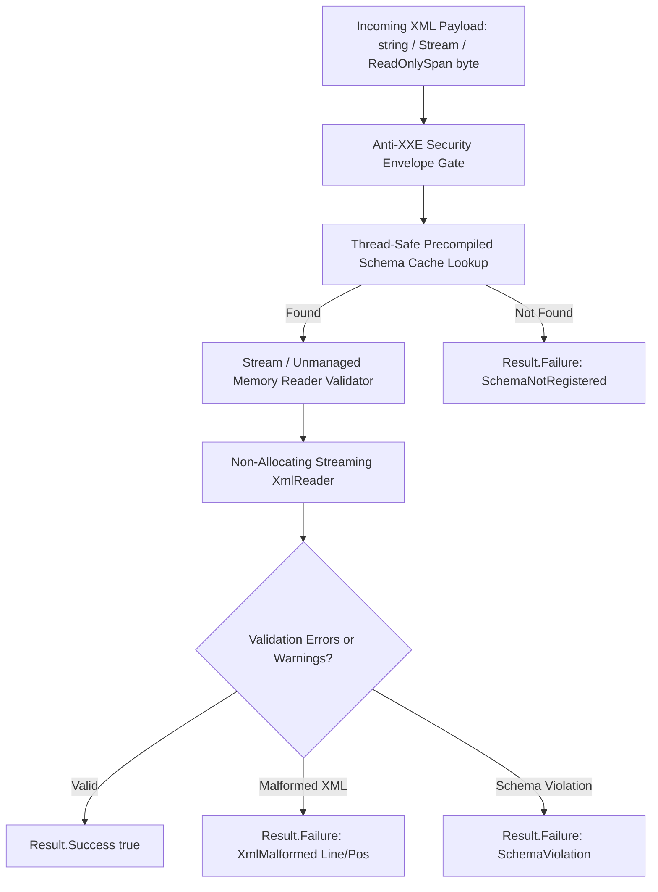

# Level 00: Architectural Introduction & Mental Model

## 1. Overview & Problem Statement

In enterprise ingestion architectures (financial messaging, EDIFACT, invoice exchange, health records), validating untrusted XML payloads with default .NET runtime APIs introduces critical systemic risks:
- **XML External Entity (XXE) Vulnerabilities**: Default `XmlReaderSettings` in legacy runtimes allow DTD processing and external entity resolution, enabling SSRF, local file disclosure, and server denial-of-service.
- **Exceptions as Control Flow**: Standard .NET `XmlReader` and `XmlDocument` throw `XmlException` and `XmlSchemaValidationException` upon encountering invalid documents, creating substantial thread suspension and Gen 0/Gen 2 GC pressure.
- **Heap Allocation Overhead**: Network ingestion pipelines frequently transcode raw UTF-8 byte streams into temporary managed strings before parsing, generating excessive garbage collection cycles.
- **Native AOT Trimming Risks**: Traditional XML processing often relies on reflection-heavy serializers and dynamic schema compilation that fail under Native AOT.

`EricksonLopez.Xml.Validation` eliminates these vulnerabilities through a hardened, zero-allocation schema validation engine:
- **Secure By Default (Anti-XXE)**: Inline DTD processing is prohibited (`DtdProcessing.Prohibit`) and `XmlResolver` is set to `null` across all synchronous and asynchronous code paths.
- **Functional Error Handling via Result<T>**: Validation failures return a strongly typed `Result<bool>` containing diagnostic line and position coordinates without throwing exceptions.
- **Zero-Allocation Span Modality**: Direct validation of `ReadOnlySpan<byte>` buffers via unmanaged memory streams without heap copies or intermediate string allocations.
- **100% Native AOT Compatible**: Fully trimmed and verified under Native AOT (`PublishAot=true`).

---

## 2. Validation Processing Pipeline

---

## 3. Architecture Comparison Matrix

| Architectural Dimension | Default .NET XmlReader / System.Xml | FluentValidation XML / Custom Code | EricksonLopez.Xml.Validation |
| :--- | :--- | :--- | :--- |
| **XXE & SSRF Protection** | Manual configuration required | Inconsistent | **Enforced By Default (Prohibit + Null Resolver)** |
| **Error Handling** | Throws `XmlSchemaValidationException` | Mixed exceptions | **Functional `Result<bool>` (Zero Exceptions)** |
| **Precompiled Cache** | Manual `XmlSchemaSet` synchronization | None | **Thread-Safe Concurrent Cache with Namespace Keying** |
| **Span<byte> Ingestion** | Not supported (requires Stream or string) | String conversion | **Zero Heap Copy via `UnmanagedMemoryStream`** |
| **Native AOT Compliance** | Partial (reflection in schema compiler) | Unknown | **100% Verified with Native AOT Smoke Test** |
| **Warning Disciplinary Policy** | Discarded by default | Ignored | **Configurable via `XmlValidationOptions`** |
