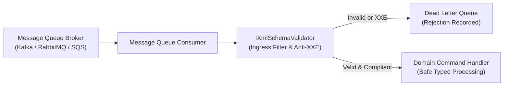

# Level 09: Architectural Boundaries & Consumer Integration

## Overview

A foundational engineering principle of the EricksonLopez platform is **strict architectural boundary discipline**:
> **EricksonLopez.Xml.Validation is a Tier 0 in-memory compute library.**

It does NOT reference external messaging brokers (Kafka, RabbitMQ, Azure Service Bus), distributed locking engines (Redis, ZooKeeper), or database drivers. Integration with external infrastructure is achieved through clean composition in upper layers.

---

## 1. Message Queue Consumer Integration Pattern

When receiving binary XML messages from a queue broker (RabbitMQ/Kafka), `IXmlSchemaValidator` operates as an ingress filter to validate messages before deserialization:



```csharp
public sealed class MessageQueueXmlConsumer
{
    private readonly IXmlSchemaValidator _validator;

    public MessageQueueXmlConsumer(IXmlSchemaValidator validator)
    {
        _validator = validator;
    }

    public async Task<Result<bool>> ProcessIncomingMessageAsync(
        byte[] payload,
        string targetNamespace,
        CancellationToken ct)
    {
        using var stream = new MemoryStream(payload);

        // Step 1: Validate schema and Anti-XXE rules prior to deserializing
        var validationResult = await _validator.ValidateAsync(stream, targetNamespace, ct);

        if (validationResult.IsFailure)
        {
            // Route invalid payload to Dead Letter Queue (DLQ)
            return validationResult;
        }

        // Step 2: Payload guaranteed valid; proceed with domain handling
        return Result<bool>.Success(true);
    }
}
```

---

## Code Reference
- [`Level09ArchitecturalBoundariesAndConsumers.cs`](https://github.com/ericksonlopezf/dotnet-xml/blob/main/samples/EricksonLopez.Xml.Showcase/Levels/Level09ArchitecturalBoundariesAndConsumers.cs)
