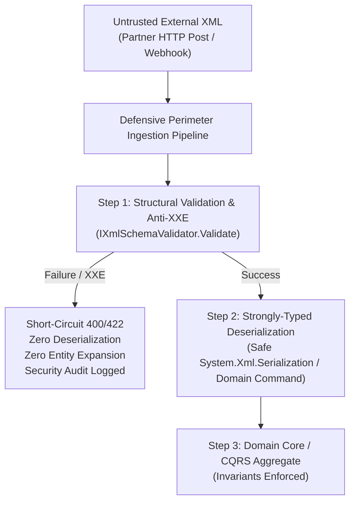

# Level 10: Enterprise Architecture & Defensive Perimeter Pipeline

## Overview

In zero-trust enterprise environments (e.g., government tax engines like DGII e-CF, banking ISO 20022 gateways, or EDI supply chain systems), unvalidated payloads must **never** reach domain models or deserializers.

---

## 1. Perimeter Defensive Gateway Pattern

`IXmlSchemaValidator` acts as a frontline firewall at the system perimeter:



---

## 2. Ingestion Pipeline Implementation

```csharp
public sealed class EnterpriseXmlIngestionPipeline
{
    private readonly IXmlSchemaValidator _validator;

    public EnterpriseXmlIngestionPipeline(IXmlSchemaValidator validator)
    {
        _validator = validator;
    }

    public async Task<PipelineResponse> ExecuteAsync(string rawXml, string targetNamespace)
    {
        // Perimeter Firewall: Enforce XSD schema and Anti-XXE protection
        var validationResult = _validator.Validate(rawXml, targetNamespace);

        if (validationResult.IsFailure)
        {
            // Defensive short-circuit: Abort before domain deserializers are invoked
            return new PipelineResponse(
                Status: "REJECTED_AT_PERIMETER",
                Message: $"XML rejected: {validationResult.Error.Description}");
        }

        // Domain Core: Ingestion permitted with verified contract integrity
        return new PipelineResponse(
            Status: "ACCEPTED_AND_PROCESSED",
            Message: "XML verified and processed into domain core.");
    }
}
```

---

## Code Reference
- [`Level10EnterpriseArchitecture.cs`](https://github.com/ericksonlopezf/dotnet-xml/blob/main/samples/EricksonLopez.Xml.Showcase/Levels/Level10EnterpriseArchitecture.cs)
